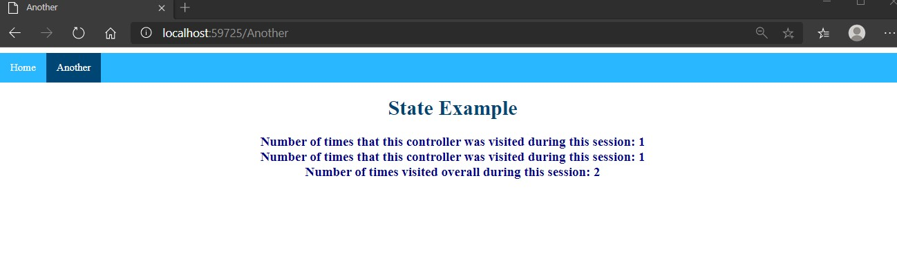
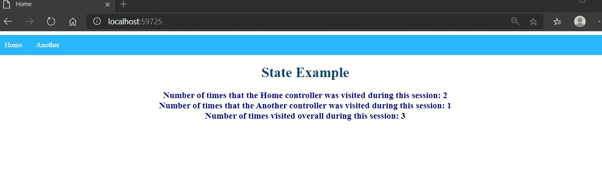
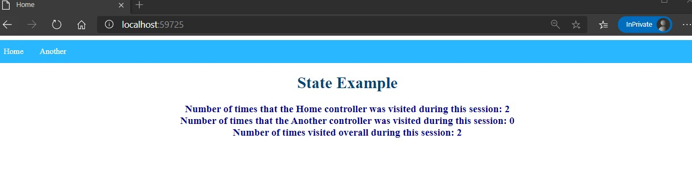

# Tareas del MOC

## Module 12: Performance and Communication

# Lesson 2: Managing State

### Demonstration: How to Store and Retrieve State Information

- En el middleware registramos la sesion

- Modificamos el **HomeController** para incluir los contadores de sesiones en el index

- Modificamos el **AnotherController** para incluir los contadores de sesiones en el index

- Modificamos el **Index  del home** para incluir los contadores de sesiones 

- Modificamos el **Index  del Another** para incluir los contadores de sesiones 

- EJecutamos

  Another

Home

Abrimos una ventana privada y comprobamos los contadores

